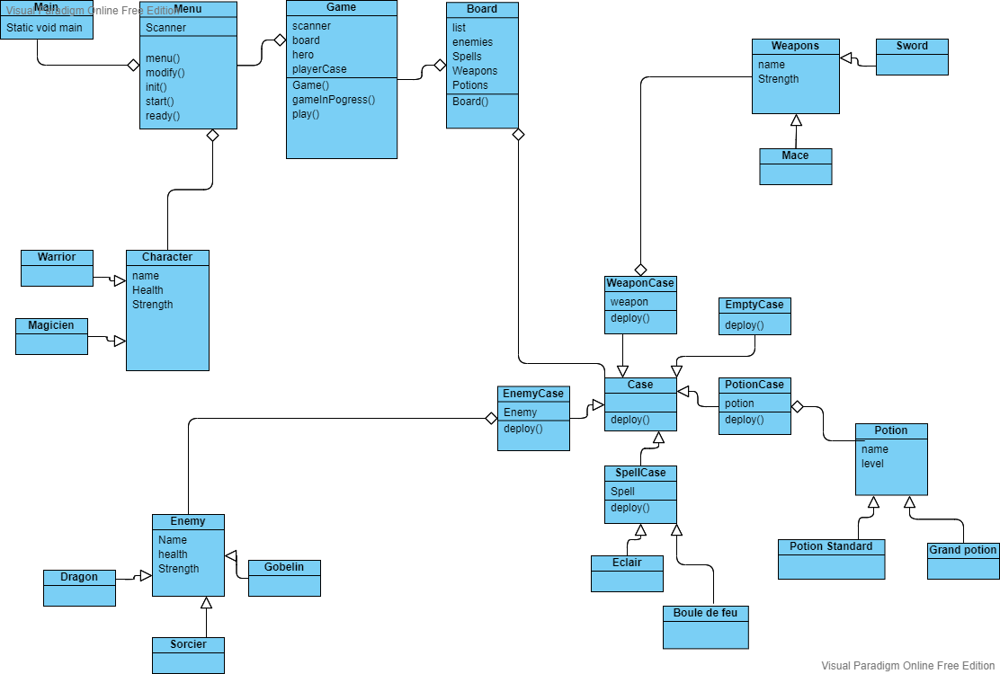

///////AJOUTER UNE NOUVELLE POTION///////

-Créer une classe dans le package abilities
-La classe doit extend de la classe <potion>
-Initialiser le constructeur parent et passer les paramètres dans cet ordre : HP, Nom;

///////AJOUTER UN NOUVEAU SPELL///////

-Créer une clase dans le package abilities
-La classe doit extend de la classe <Spell>
-Initialiser le constructeur parent et passer les pararent et passer les paramètres dans cet ordre : nom, level;

///////AJOUTER UNE NOUVELLE ARME///////

-Créer une clase dans le package abilities
-La classe doit extend de la classe <Weapon>
-Initialiser le constructeur parent et passer les pararent et passer les paramètres dans cet ordre : nom, level;

///////AJOUTER UN NOUVEAU PERSONNAGE ENNEMI ///////

-Créer une classe dans le package enemies
-La classe doit extends de la classe <Enemy>
-Initialiser le constructeur parent et passer les paramètres dans cet ordre : Nom, HP, Force, image (string);

///////AJOUTER UN NOUVEAU PERSONNAGE JOUABLE///////

-Créer une classe dans le package characters
-La classe doit extend de <characters>
- Initialiser ses constructeurs sous cette forme ci :  ( remplacer tout ce qui se trouve entre chevrons <> par la donnée voulue )

   private Spell spell;

    public <nomDuTypeDePersonnage>() {

        super();
        this.<ability> = new ability_type();
    }

    public <nomDuTypeDuPersonnage>(String name) {
       super(name, <valeurHP, <valeurDMG> ,"img" );
        this.<ability> = new <ability_Type();

    }

    public <nomDuTypeDePersonnage>(String Name, String Img, int Health, int Strength) {
        super(Name, Health, Strength, Img);
        this.<ability> = new <ability_type>();
    }

